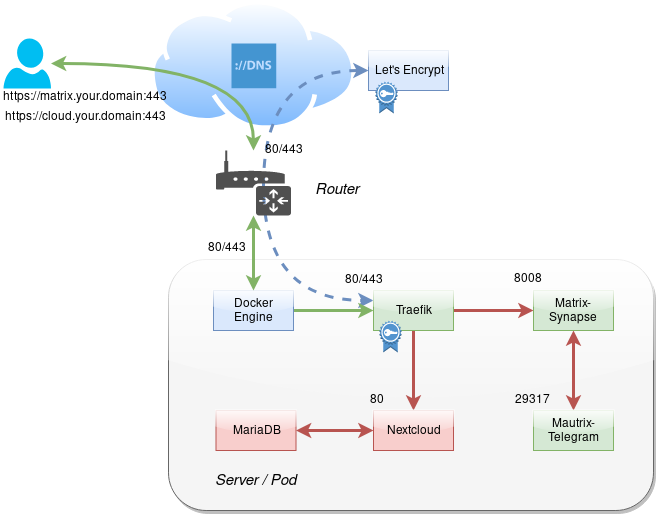

# liberty-server
Free yourself from the big cloud providers and run your own cloud services. This repository aims to help you to quickly set up and run a dockerized homeserver with Nextcloud and other free apps.

## About
Liberty Server is a set of Docker setup files helping you to set up your own nextcloud server with Docker on Linux.