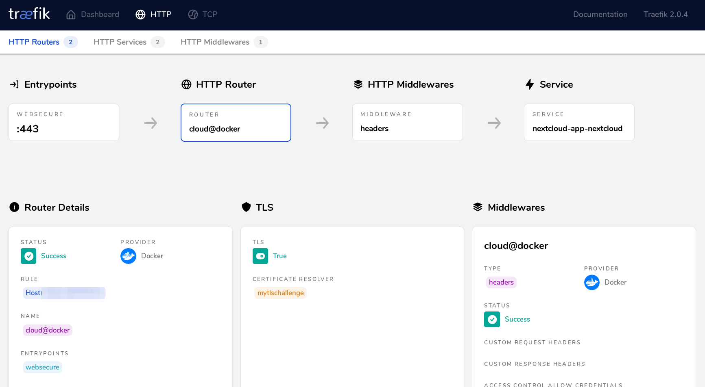

# How to use Traefik (v2.x)



## Note: This is a let's encrypt example using TLS Challenge

My traefik v2.x configuration example uses let's encrypt to obtain ssl certificates. There are different methods to acquire a certificate: TLS Challenge, HTTP Challenge, and DNS Challenge. While my traefik v1.x example used HTTP Challenge, this traefik v2.0 example uses TLS Challenge. The advantage of TLS over HTTP Challenge is that you do not need to open port 80 to the public anymore.

Read more about the different configurations here: <https://docs.traefik.io/v2.0/user-guides/docker-compose/acme-tls/>

## New labels for your containers

Add the following labels to your containers to make them available in traefik:

```
      - "traefik.enable=true"
      - "traefik.http.routers.whoami.rule=Host(`whoami.mydomain.com`)"
      - "traefik.http.routers.whoami.entrypoints=websecure"
      - "traefik.http.routers.whoami.tls.certresolver=mytlschallenge"
      - "traefik.docker.network=webproxy"
```

Replace "whoami" with the container name and edit the hostname.

## Switch from Traefik 1 to Traefik 2

1. Add the new labels to your containers
2. Change into the traefik2/letsencrypt folder and create the ```acme.json``` file. Change the permissions of the file to 600 with ```chmod 600 acme.json```.
3. Change into the traefik2 folder and edit the docker-compose.yaml file. The change that must be done is adding your email address.
4. Stop your old traefik1 container
5. Run docker-compose up -d from the traefik2-folder to start the new service.
6. Check the traefik's status on <http://localhost:8080>
7. When all works, remember to permanently disable your trafik1 container and close port 80 on your router/firewall.

## Folders

```/letsencrypt``` - in this folder your certificates will be stored.

```/rules``` - in this folder additional traefik rules are stored. For a start I added extra tls rules which cannot be added as container labels. Check <https://docs.traefik.io/v2.0/https/tls/#tls-options> for more information.

## Create Network

```Bash
docker network create traefik_proxy
```

## Prepare the docker-compose-file and start the container the first time


Before running the ```docker-compose up``` command, you need to edit the docker-composer file in the traefik2 folder and set your eMail address. This is important for registration of your domain with Let’s Encrypt. If you do not provide a valid address here ou will not be notified when there is a problem with your certificates!


Start traefik with the command ```docker-compose up```.

## Traefik dashboard

Traefik provides a dashboard on port 8080. To make it available you have to allow access to this port on your server. On a Fedora/Red Hat based machine a temporary firewall rule can be set like this:

```bash
$ sudo firewall-cmd --zone=public --add-port=8080/tcp
```

## Troubleshooting

### Bad Gateway

Check if the network of your container matches the traefik network. In my example this is ```webproxy```. Containers that are to be available from the Internet through traefik must be in this network.
